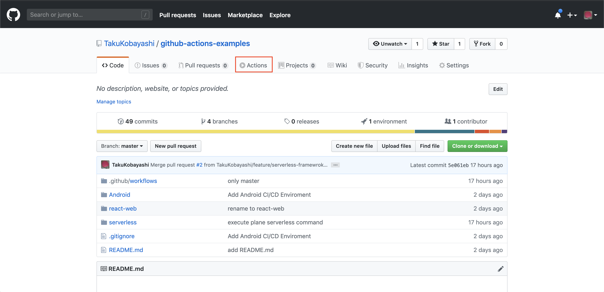
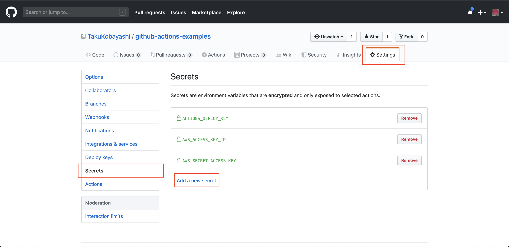
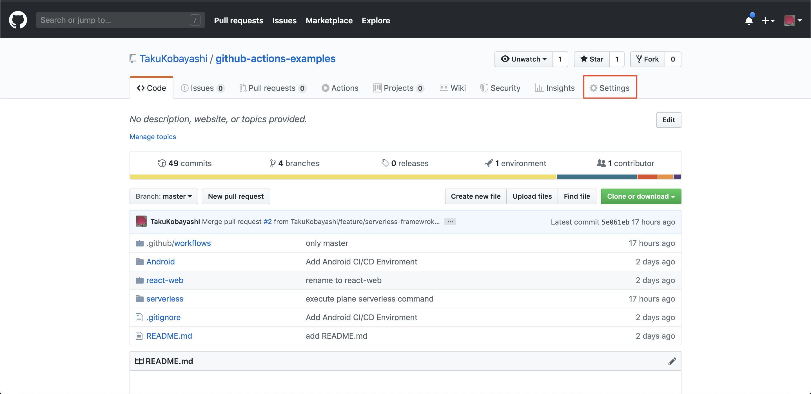
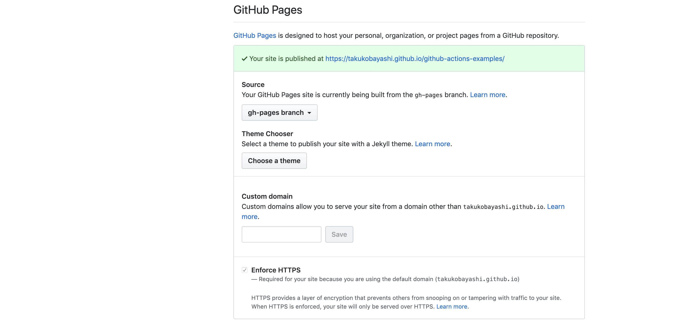
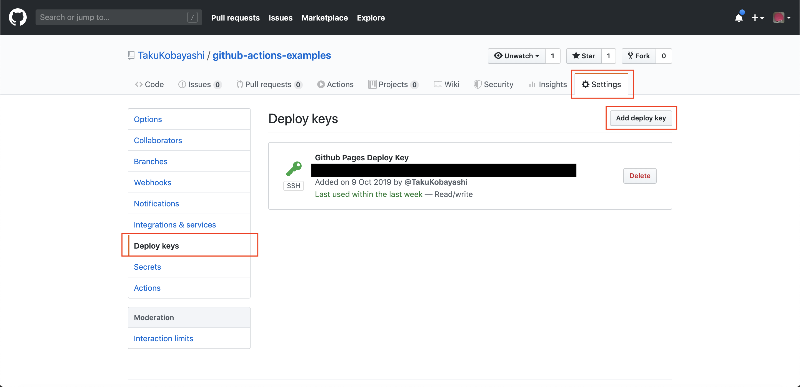

# Github Actionsで自動デプロイしてみる

## やってみる開発環境
 * [React Web](https://ja.reactjs.org/)
 * [Serverless Framework](https://serverless.com/) (AWS)
 * [Firebase (hosting/functions)](https://firebase.google.com/) (未実装,実装予定)
 * Android
 * iOS (未実装, 実装予定)
 * [Unity](https://unity.com/) (未実装, 実装予定)

## 目的

Github Actionsが使用できるようになったのでGithub上でのCI/CDの検証を行う。
CI/CDの検証を行って、うまく行く方法が確立されたら、他のプロジェクトにも適用する。

## やりたいこと
 * [React Web](https://ja.reactjs.org/): ReactでWeb frontendの開発を行い、masterにpushされたら自動的にbuildする。Buildが完了したら Github PagesにDeployして内容が反映されること
 * [Serverless Framework](https://serverless.com/): Serverless FrameworkよりBackendの開発を行いWeb APIを作成。masterにpushされたら自動的にdeployコマンドを実行し、AWS Lambda + ApiGatewayの環境にdeployして反映されること
 * [Firebase](https://firebase.google.com/): [Firebase Hosting](https://firebase.google.com/docs/hosting), [Firebase Cloud Functions](https://firebase.google.com/docs/functions/) にて、それぞれfrontend/backendの開発を行う。masterにpushされたら自動的に firebase cli のdeployコマンドを実行し、反映されること
 * Android: Androidアプリを開発し、pushしたらbuildし、完了したらApkファイルをダウンロードすることができること。またRelease Keyを作成し、Google Play Storeにアップロードすること
 * iOS: iOSアプリを開発し、pushしたらbuildし、完了したらipaファイルをダウンロードすることができること。また、ipaファイルをApp Storeにアップロードできるようにもすること
 * [Unity](https://unity.com/): Unityで開発を進める。完了したら、動画の抽出(映像作品)、Androidアプリのビルド、iOSアプリのビルドができること。また、Storeへのアップロードも可能であれば実施したい。

## Tips

### Github Actionsのはじめ方

GithubにてGithub Actionsを有効にして、 `.github/workflows/フォーマットしたymlファイル` を設置する事でGithub Actionsが実行可能になります。(現在まだオープンβ盤なの利用するには申請が必要になります。[こちら](https://github.com/features/actions)から申し込みを行ってください。)



なお、今回作成したymlファイルの設定内容の詳細についてはそれぞれ[こちら](./.github/workflows/)を参照してください。

### Github Actionsにて非公開にしたい変数を登録して使用する

API Keyや環境変数などオープンにしたくない情報は `Secrets` に変数を登録することで、公開されることなく利用することができます。
以下のようにリポジトリから `Settings` → `Secrets` と選択し、`Add a new Secrets` と選択することで設定することができます。



<font color="#FF0000">※ 一度設定したSecretsは内容を確認する事はできません。またGithub Actionsの中で出力しようとしても値は表示されませんので、設定には気をつけてください。</font>

設定した, `Secrets` は以下のように `env:` の項目に設定した `Key名` を代入する事でコマンドの中などで使用されます。

```yml
- name: serverless package and deploy
  env:
    AWS_ACCESS_KEY_ID: ${{ secrets.AWS_ACCESS_KEY_ID }}
    AWS_SECRET_ACCESS_KEY: ${{ secrets.AWS_SECRET_ACCESS_KEY }}
  run: |
    ./node_modules/serverless/bin/serverless config credentials --provider aws --key ${AWS_ACCESS_KEY_ID} --secret ${AWS_SECRET_ACCESS_KEY}
```

上記の内容はServerless FrameworkにてAWS環境にDeployするためにAWSへのAPIアクセスキーを設定している内容になります。
具体的な実装例は
[こちら](./.github/workflows/serverless-deploy.yml) になります。


### Github PagesへのDeploy方法

 * `Settings` よりGithub Pagesを有効にする




 * 公開鍵と秘密鍵のペアを生成する(以下コマンドを実行する)

```
ssh-keygen -t rsa -b 4096 -C "$(git config user.email)" -f gh-pages -N ""
```

* 作成した公開鍵(gh-pages.pub)の中身を `Deploy Keys` に登録する

* 作成した秘密鍵(gh-pages)の中身を `Secrets` に登録する

* `Workflowのyml`の中の`steps`の項目に以下の内容を適用する

```yml
    - name: deploy
      uses: peaceiris/actions-gh-pages@v2.5.0
      env:
        ACTIONS_DEPLOY_KEY: ${{ secrets.ACTIONS_DEPLOY_KEY }}
        PUBLISH_BRANCH: gh-pages
        PUBLISH_DIR: frontend/build
```

これで設定完了なので、特定のブランチにpushしたら、自動的にGithub Pagesにデプロイしてくれるようになります。

#### 設定したymlについての解説

詳細については[こちら](./.github/workflows/react-web-ci-cd.yml)を参照してください。

 * Github Pagesへのデプロイは[actions-gh-pages](https://github.com/peaceiris/actions-gh-pages)というライブラリを使用しています。このライブラリを使用しています。ライブラリを使用する場合は `step` の項目のところで、`uses:` の項目を指定すると使用できます。この場合、`run:` 項目や `working-directory:`項目を使用することができません。
 * `secrets.ACTIONS_DEPLOY_KEY`は上記で登録した`Secret` の変数名の値が適用されます。Github Actionsの中で使用したい場合は `env:` 項目内で変数に指定することで使用することができます。(ライブラリの場合は指定があります)
 * `PUBLISH_BRANCH`の項目で`Github Pages`にデプロイしたいブランチを指定することができます。このとき `gh-pages` を指定していますが存在しなければ、Workflowを実行している中で勝手に作成してくれます。しかし、最初に作成する時はうまくdeployできないこともあるので、あらかじめ作っておくといいかもしれません。また `gh-pages` ブランチは Github Pagesの公開用のブランチとして指定することもできます。(うまくいかないかもしれないので、指定しておいたほうがいいと思います)

### AndroidアプリのBuild, Google Play Storeへの反映方法


### AndroidのKeystoreファイルをJKS p12に変換する方法

```
keytool -importkeystore -srckeystore mykey.keystore -destkeystore mykey.p12 -srcstoretype jks -deststoretype pkcs12
```

#### 参考

 * [鍵ストアファイルとアプリの署名に関する情報の整理](https://tech.at-iroha.jp/?p=734)


### 参考
 * [actions-gh-pages](https://github.com/peaceiris/actions-gh-pages)
 * [GitHub Actions による GitHub Pages への自動デプロイ](https://qiita.com/peaceiris/items/d401f2e5724fdcb0759d)
 * [GitHub Actionsの仮想環境](https://help.github.com/ja/articles/virtual-environments-for-github-actions)

### 疑問点(課題)
 * GithubのWeb Page上からGithub Actionsを実行するやり方(手動実行のやり方)